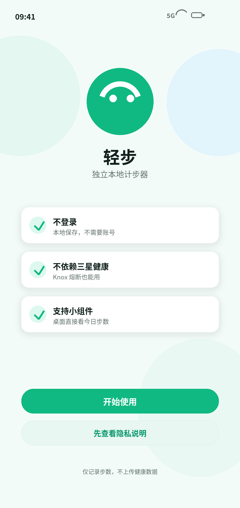
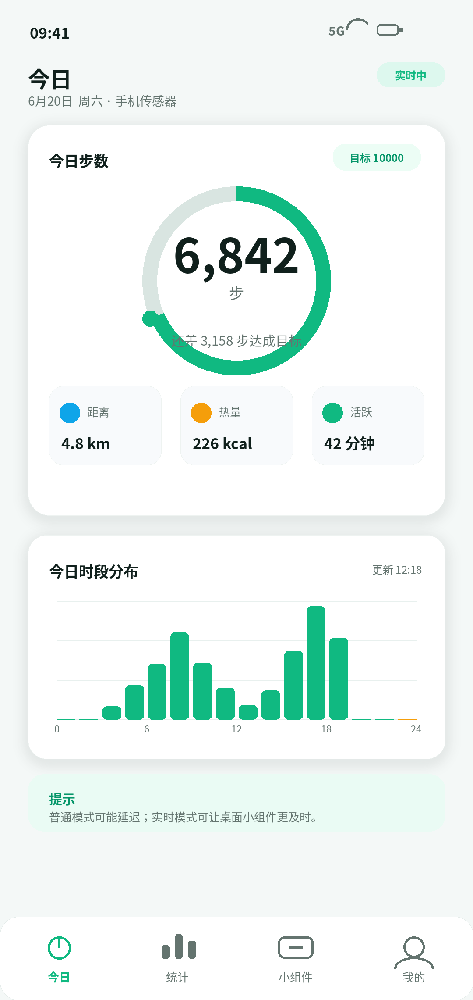
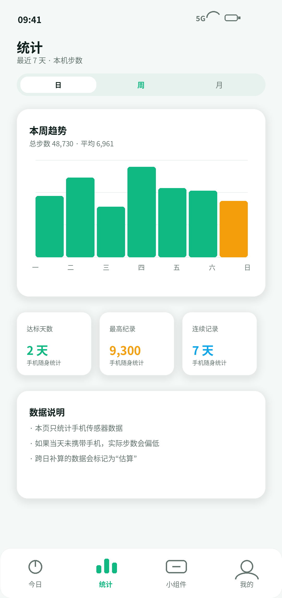
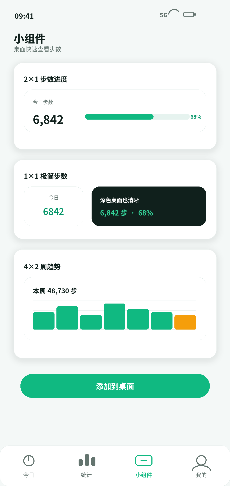
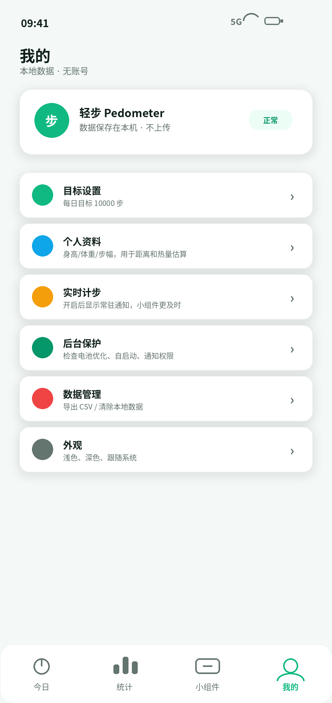
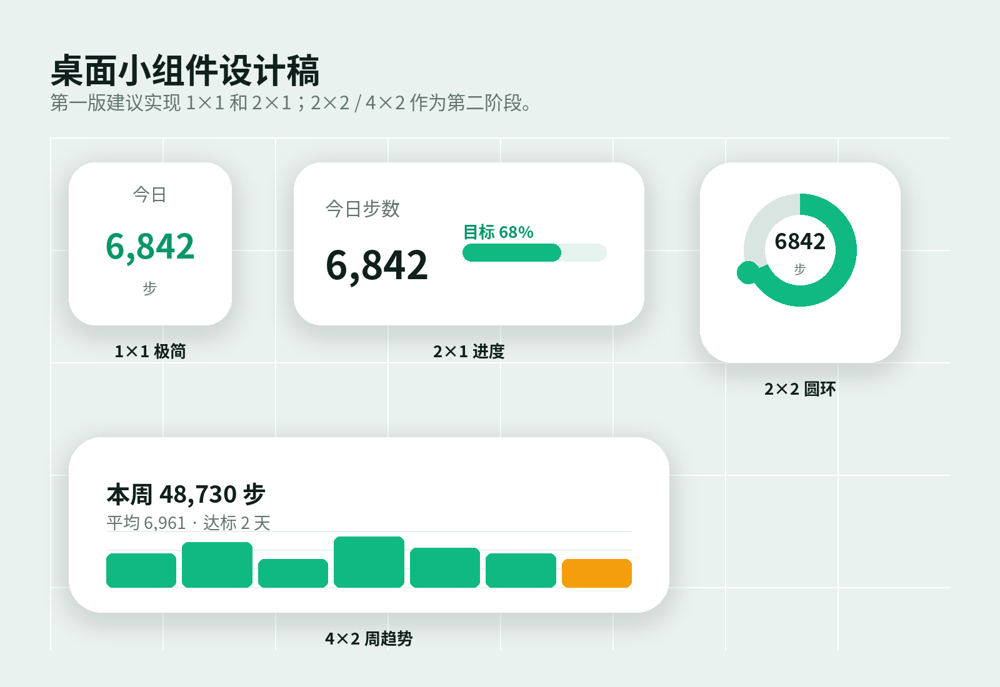

# 轻步 Pedometer

轻步 Pedometer 是一个本地 Android 计步器项目，目标是在不依赖三星健康、华为运动健康、Google Fit 或云账号的情况下，直接读取手机硬件计步传感器，提供今日步数、统计、桌面小组件和后台刷新能力。

项目当前更偏向“轻量、可自测、可继续迭代”的本地计步应用：数据保存在手机本地 Room 数据库中，不上传健康数据。

## 功能概览

- 本地计步：读取 Android `TYPE_STEP_COUNTER` 硬件计步传感器。
- 今日页：显示今日步数、目标进度、距离、热量、活跃分钟和时段分布。
- 统计页：支持日、周、月统计切换。
- 桌面小组件：提供步数和每日活动量两组小组件，覆盖 1x1、2x1、2x2、4x1、4x2 等尺寸。
- 普通模式：以低频同步为主，亮屏、解锁、打开 app、点击小组件时触发刷新。
- 实时模式：以前台服务监听计步传感器，更及时刷新通知和小组件。
- 小组件同步服务：普通模式下可保持桌面小组件更及时更新，但耗电低于实时模式。
- 后台保护入口：提供忽略电池优化、后台活动设置入口，方便在系统中放行后台刷新。
- 本地隐私：Room 数据库存储在应用私有目录，不需要登录和网络上传。

## 设计预览

仓库中保留了早期 UI 设计稿，便于了解产品方向和后续对照优化。

| 页面 | 预览 |
| --- | --- |
| 权限引导 |  |
| 今日首页 |  |
| 周统计 |  |
| 小组件配置 |  |
| 设置页 |  |
| 小组件合集 |  |

## 小组件

当前包含两类小组件。

步数组件：

- `轻步今日步数`：极简今日步数。
- `轻步进度`：今日步数、公里数、百分比和连续进度条。
- `轻步步数 2x2`：卡片式步数、目标、距离、进度条。
- `轻步步数 4x1`：横条式步数和目标进度。
- `轻步步数 4x2`：步数、目标、距离、进度和近 7 天趋势。

每日活动量组件：

- `轻步每日活动 2x1`
- `轻步每日活动 2x2`
- `轻步每日活动 4x1`
- `轻步每日活动 4x2`

小组件支持点击刷新。普通模式下，系统对桌面小组件有刷新限制，所以应用额外做了亮屏/解锁刷新和小组件同步服务。不同手机厂商的桌面和省电策略差异很大，建议在测试机上允许后台活动并忽略电池优化。

## 计步口径

应用最终步数以 Android 硬件计步传感器 `TYPE_STEP_COUNTER` 为准。这个传感器返回的是“本次开机后累计步数”，应用会记录每日基准值，再换算成当天步数。

当前实现包含以下保护：

- 跨日时自动生成当天基准。
- 手机重启或传感器重置时保留当天可信步数。
- 同一开机周期内，如果传感器短时间返回比上一条更小的乱序值，会忽略这条回退数据，避免重复加步。
- 实时模式也只以系统总步数为最终口径，不再直接叠加 `TYPE_STEP_DETECTOR` 临时步，减少和三星健康对比时偏多的问题。

距离和热量为估算值：

- 默认步幅：`83 cm`
- 默认体重：`65 kg`
- 距离：`步数 * 步幅`
- 热量：按距离、体重和经验系数估算

这组默认值是为了让当前测试机在 `1753 步` 时接近三星健康显示的 `1.45 km / 77 kcal`。如果后续要适配更多用户，建议在“我的”页面加入身高、体重、步幅的可编辑设置。

## 刷新模式说明

### 普通模式

普通模式更省电，适合日常使用。它主要依靠以下时机更新：

- 打开 app 时同步。
- 点击“刷新”按钮时同步。
- 点击桌面小组件时同步。
- 系统亮屏或解锁广播触发同步。
- WorkManager 定期后台同步。

注意：Android 不提供“切换到某个桌面页面”这种稳定广播，所以仅靠普通模式无法保证像系统健康应用一样在每次回到桌面瞬间刷新。不同系统桌面也可能限制小组件刷新频率。

### 实时模式

实时模式会启动前台服务，持续监听计步传感器：

- 更新更及时。
- 会显示常驻通知。
- 比普通模式更耗电、占用更高，但只监听系统计步传感器，不做 GPS 记录。

### 小组件同步服务

为改善普通模式小组件不更新的问题，应用增加了小组件同步服务：

- 只监听 `TYPE_STEP_COUNTER`。
- 只在有小组件且权限满足时运行。
- 比实时模式轻，但仍属于后台/前台服务，系统会显示低优先级通知。

## 权限说明

应用可能用到以下权限：

- `ACTIVITY_RECOGNITION`：Android 10 及以上读取身体活动/计步传感器需要。
- `POST_NOTIFICATIONS`：Android 13 及以上显示实时模式或小组件同步通知需要。
- `FOREGROUND_SERVICE` / `FOREGROUND_SERVICE_HEALTH`：实时计步和小组件同步服务需要。
- `RECEIVE_BOOT_COMPLETED`：手机重启后恢复定期同步和小组件刷新。
- `REQUEST_IGNORE_BATTERY_OPTIMIZATIONS`：跳转系统设置，帮助用户允许后台运行。

应用不需要网络权限，不上传步数、距离、热量或其他健康数据。

## 技术栈

- Kotlin
- Jetpack Compose
- Material 3
- Room
- WorkManager
- Android AppWidget / RemoteViews
- Gradle Android Plugin
- minSdk 24
- targetSdk 34
- Java 17

## 项目结构

```text
.
├─ app/
│  ├─ src/main/java/com/lightstep/pedometer/
│  │  ├─ data/        # Room 实体、DAO、数据库和计步仓库
│  │  ├─ domain/      # 日期、系统启动、步数换算逻辑
│  │  ├─ sensor/      # 计步传感器读取器
│  │  ├─ service/     # 实时计步、小组件同步、亮屏刷新、开机广播
│  │  ├─ ui/          # Compose 页面
│  │  ├─ widget/      # AppWidget Provider 和更新逻辑
│  │  └─ worker/      # WorkManager 定期同步
│  └─ src/main/res/
│     ├─ layout/      # 小组件 RemoteViews 布局
│     ├─ drawable/    # 小组件背景、图标、进度条
│     ├─ values/      # 颜色、字符串、样式
│     └─ xml/         # 小组件 provider 配置
├─ 安卓计步器App_UI设计稿_PNG/
├─ 安卓计步器App详细开发方案.docx
├─ 安卓计步器App开发方案_修订版.docx
└─ README.md
```

## 构建环境

推荐环境：

- Android Studio
- Android SDK 34
- JDK 17
- Windows / macOS / Linux 均可

本机调试时使用 Android Studio 自带 JBR：

```powershell
$env:JAVA_HOME='F:\Android\Android Studio\jbr'
$env:Path="$env:JAVA_HOME\bin;$env:Path"
```

如果你的 Android SDK 路径不同，需要创建本地 `local.properties`：

```properties
sdk.dir=F\:\\Android\\SDK
```

`local.properties` 已被 `.gitignore` 排除，不会提交到仓库。

## 构建命令

Debug 包：

```powershell
.\gradlew.bat assembleDebug
```

Lint：

```powershell
.\gradlew.bat lintDebug
```

Release 包：

```powershell
.\gradlew.bat assembleRelease
```

输出路径：

```text
app/build/outputs/apk/debug/app-debug.apk
app/build/outputs/apk/release/app-release.apk
```

当前 `release` 构建仍使用 debug 签名，正式发布前应替换为自己的 release keystore。

## 安装到手机

确认设备连接：

```powershell
adb devices
```

覆盖安装 debug 包：

```powershell
adb install -r app/build/outputs/apk/debug/app-debug.apk
```

刷新小组件：

```powershell
adb shell am broadcast -a com.lightstep.pedometer.widget.REFRESH -n com.lightstep.pedometer/.widget.StepProgressWidgetProvider
```

## 常见问题

### 为什么桌面小组件没有马上更新？

Android 对小组件刷新有限制，系统桌面也可能缓存 RemoteViews。建议：

- 打开 app 点一次“刷新”。
- 点击小组件触发刷新。
- 允许后台活动。
- 忽略电池优化。
- 需要更及时更新时开启实时模式。

### 普通模式和实时模式哪个更耗电？

大致关系是：

```text
实时模式 > 小组件同步服务 > 普通 WorkManager/亮屏刷新
```

实时模式最及时，但会有前台服务通知和更高耗电。普通模式更省电，但桌面小组件不一定能实时变化。

### 为什么摇手机不一定增加步数？

应用读取的是手机硬件计步传感器，不直接用加速度计手写算法。不同厂商会对“手持摇晃”和“放口袋走路”做过滤。实测放口袋走路更接近真实步行，也更接近三星健康。

### 为什么距离和热量只是估算？

Android 计步传感器只给步数，不给真实步幅、GPS 距离或代谢数据。应用当前用默认步幅、体重和经验系数估算。不同身高、走路姿态、速度都会影响结果。

### 为什么和三星健康仍可能不同？

三星健康可能融合了更多系统级数据，例如机型算法、穿戴设备、历史步幅、用户资料、运动识别和系统白名单后台能力。本项目只使用公开 Android API，因此目标是“尽量接近且稳定”，不是完全复刻三星健康内部算法。

## 隐私

- 不需要登录。
- 不上传数据。
- 不请求网络权限。
- 步数、距离、热量、设置保存在应用私有 Room 数据库。
- 卸载应用后，本地数据会随应用一起删除。

## 开发备注

当前仍可继续优化的方向：

- 增加身高、体重、步幅设置页。
- 提供每日数据重置/校准入口，方便和三星健康对齐测试。
- 更细致的小组件样式，继续贴近三星健康小组件。
- 增加导出 CSV 或本地备份。
- 增加单元测试覆盖计步基准、跨日、重启、传感器回退等逻辑。
- 正式发布前配置 release 签名和版本号管理。

## 许可证

当前仓库尚未声明开源许可证。正式公开给他人复用前，建议补充 `LICENSE` 文件。
